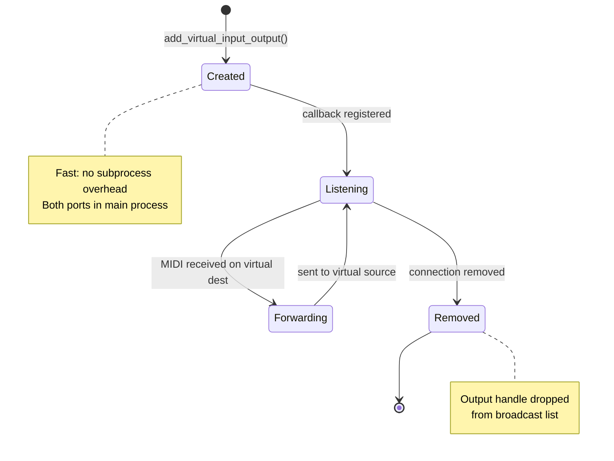
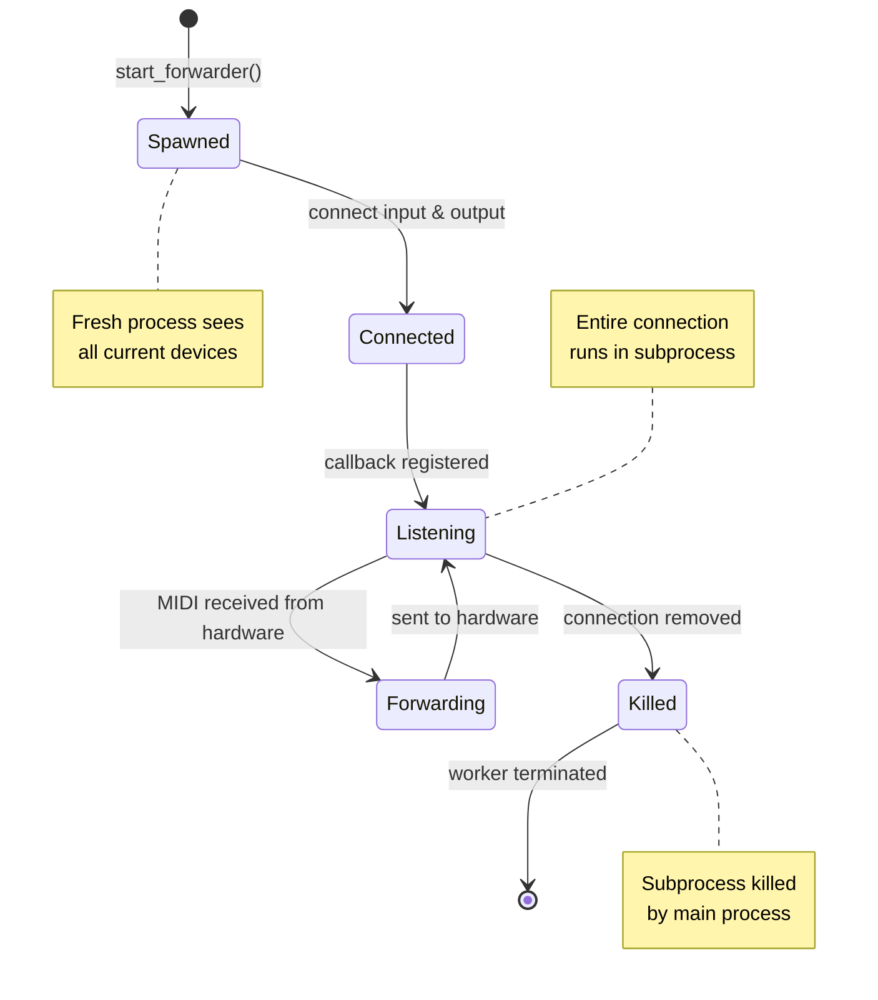
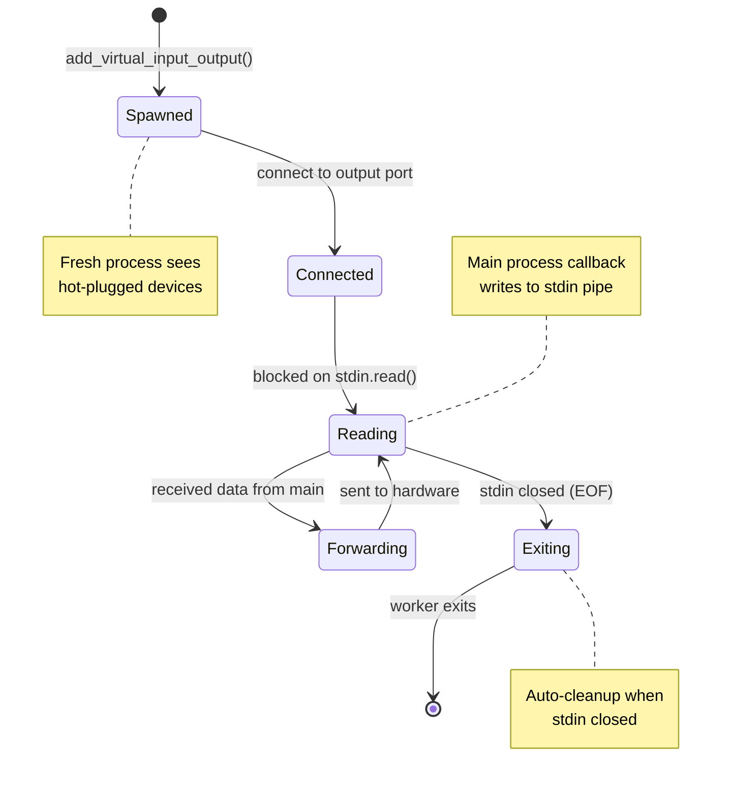
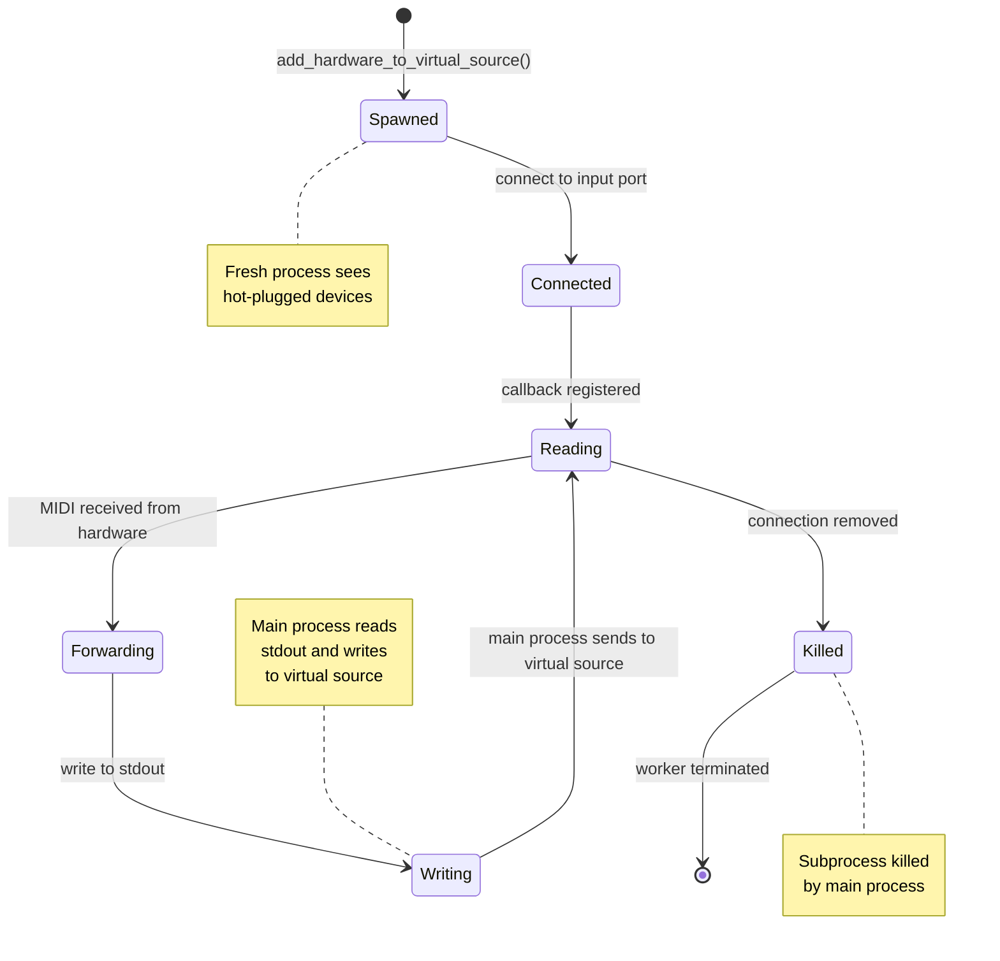
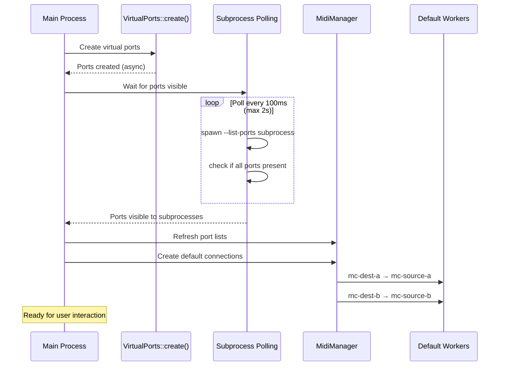
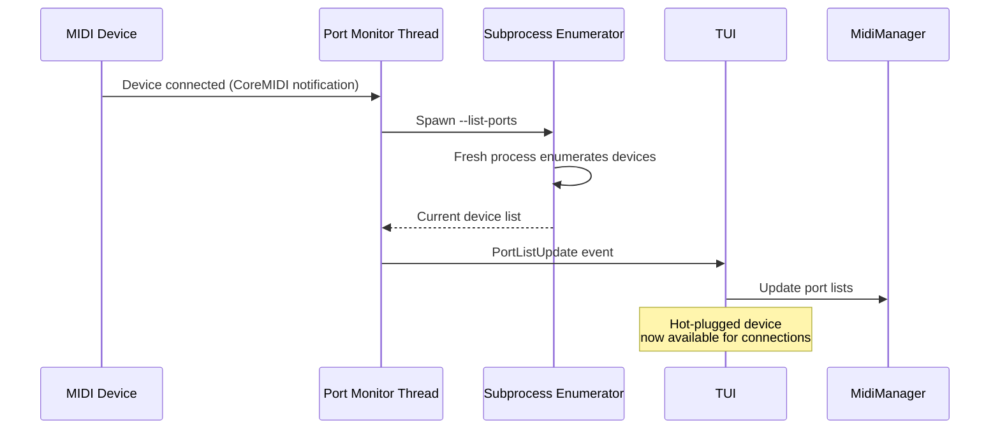

# midi-cable Architecture

## Overview

midi-cable is a Rust TUI application that routes MIDI messages between devices, with special support for hot-plugged devices (devices connected after the application starts).

## The Hot-Plug Problem

CoreMIDI (macOS) and similar MIDI APIs maintain process-level device caches that never refresh. Even creating new `MidiInput`/`MidiOutput` instances in a long-running process won't detect devices plugged in after process startup.

**Solution**: Use subprocess architecture where fresh processes see current device state.

## Architecture Components

**Main Process**:
- Virtual destinations (mc-dest-a/b) - receive MIDI from external apps
- Virtual sources (mc-source-a/b) - send MIDI to external apps
- MidiManager - spawns workers, manages connections

**Worker Subprocesses**:
- Pipe worker - reads from stdin, forwards to hardware
- Reverse pipe worker - reads from hardware, writes to stdout
- Regular worker - reads from hardware, forwards to hardware

**Key insight**: Subprocesses see hot-plugged devices (fresh CoreMIDI enumeration), while main process handles virtual ports (created by main process)

## Connection Types

All MIDI forwarding follows the pattern: receive from input, send to output. The architectural differences are about **how we handle CoreMIDI's process-level device caching** to support hot-plugged devices.

**Key constraint**: A long-running process never sees devices plugged in after it starts, even creating new `MidiInput`/`MidiOutput` instances.

**Strategy**: The architecture automatically selects the appropriate connection method:

| Connection | Strategy | Reason |
|------------|----------|--------|
| Virtual Dest → Virtual Source | In-process | Both ports created by main process |
| Virtual Dest → Hardware | Pipe worker | Need fresh enumeration for output |
| Hardware → Virtual Source | Reverse pipe worker | Need fresh enumeration for input + virtual source write access |
| Hardware → Hardware | Regular worker | Need fresh enumeration for both |

Notes:
- Virtual **destinations** (mc-dest-a/b) are inputs - other apps send to them
- Virtual **sources** (mc-source-a/b) are outputs - other apps receive from them
- You cannot forward TO a virtual destination (they're inputs, not outputs)

The key insight: **Use in-process when possible (faster), use subprocess when necessary (hot-plug support)**.

## Data Structures

### VirtualPorts

```rust
pub struct VirtualPorts {
    // Port pair A
    _input_connection_a: MidiInputConnection<()>,
    _output_connection_a: Arc<Mutex<MidiOutputConnection>>,
    input_outputs_a: Arc<Mutex<Vec<Arc<Mutex<MidiOutputConnection>>>>>,
    pipe_workers_a: Arc<Mutex<Vec<Arc<Mutex<ChildStdin>>>>>,

    // Port pair B (same structure)
    // ...
}
```

- `input_outputs_*`: In-process connections (virtual outputs, fast)
- `pipe_workers_*`: Pipe worker stdin handles (hot-plug devices)

### MidiManager

```rust
pub struct MidiManager {
    pub virtual_ports: Option<VirtualPorts>,
    forwarders: HashMap<Connection, ForwarderHandle>,           // Regular workers
    virtual_input_outputs: HashMap<Connection, Arc<...>>,       // Virtual input connections
    hardware_to_virtual: HashMap<Connection, Child>,            // Reverse pipe workers
    event_tx: Sender<AppEvent>,
    monitoring_active: Arc<AtomicBool>,
}
```

## Connection Lifecycle

### 1. In-Process (Virtual Dest → Virtual Source)


```mermaid
stateDiagram-v2
    [*] --> Created: add_virtual_input_output()
    Created --> Listening: callback registered
    Listening --> Forwarding: MIDI received on virtual dest
    Forwarding --> Listening: sent to virtual source
    Listening --> Removed: connection removed
    Removed --> [*]

    note right of Created
        Fast: no subprocess overhead
        Both ports in main process
    end note

    note right of Removed
        Output handle dropped
        from broadcast list
    end note
```

**Example**: mc-dest-a → mc-source-b

**Trade-offs**: ✅ Fast (~0.1ms) | ✅ Simple | ❌ No hot-plug support

### 2. Regular Worker (Hardware → Hardware)


```mermaid
stateDiagram-v2
    [*] --> Spawned: start_forwarder()
    Spawned --> Connected: connect input & output
    Connected --> Listening: callback registered
    Listening --> Forwarding: MIDI received from hardware
    Forwarding --> Listening: sent to hardware
    Listening --> Killed: connection removed
    Killed --> [*]: worker terminated

    note right of Spawned
        Fresh process sees
        all current devices
    end note

    note left of Listening
        Entire connection
        runs in subprocess
    end note

    note right of Killed
        Subprocess killed
        by main process
    end note
```

**Example**: MIDI keyboard → Hot-plugged synthesizer

**Data flow**: Hardware input → worker subprocess → hardware output (entirely in subprocess)

**Trade-offs**: ✅ Hot-plug support | ✅ Isolated | ⚠️ Slight latency (~0.5-1ms)

### 3. Pipe Worker (Virtual Dest → Hardware)


```mermaid
stateDiagram-v2
    [*] --> Spawned: add_virtual_input_output()
    Spawned --> Connected: connect to output port
    Connected --> Reading: blocked on stdin.read()
    Reading --> Forwarding: received data from main
    Forwarding --> Reading: sent to hardware
    Reading --> Exiting: stdin closed (EOF)
    Exiting --> [*]: worker exits

    note right of Spawned
        Fresh process sees
        hot-plugged devices
    end note

    note left of Reading
        Main process callback
        writes to stdin pipe
    end note

    note right of Exiting
        Auto-cleanup when
        stdin closed
    end note
```

**Example**: mc-dest-a → Hot-plugged synthesizer

**Data flow**: Virtual dest callback → stdin pipe → worker subprocess → hardware output

**Trade-offs**: ✅ Hot-plug support | ⚠️ Slight latency (~0.5-1ms) | ⚠️ Process overhead

### 4. Reverse Pipe Worker (Hardware → Virtual Source)


```mermaid
stateDiagram-v2
    [*] --> Spawned: add_hardware_to_virtual_source()
    Spawned --> Connected: connect to input port
    Connected --> Reading: callback registered
    Reading --> Forwarding: MIDI received from hardware
    Forwarding --> Writing: write to stdout
    Writing --> Reading: main process sends to virtual source
    Reading --> Killed: connection removed
    Killed --> [*]: worker terminated

    note right of Spawned
        Fresh process sees
        hot-plugged devices
    end note

    note left of Writing
        Main process reads
        stdout and writes
        to virtual source
    end note

    note right of Killed
        Subprocess killed
        by main process
    end note
```

**Example**: Hot-plugged Nome Clock → mc-source-b

**Data flow**: Hardware input → worker subprocess → stdout pipe → main process → virtual source

**Trade-offs**: ✅ Hot-plug support | ✅ Virtual source write access | ⚠️ Slight latency (~0.5-1ms)

## Design Rationale

### Why Subprocesses?

**Problem**: CoreMIDI caches device lists at process startup and never refreshes.

**Solutions Considered**:
1. ❌ Poll for device changes in main process → cache never refreshes
2. ❌ Use CoreMIDI notifications → notifications fire but enumeration still stale
3. ✅ **Subprocess enumeration** → fresh process sees current state

### Why Different Worker Types?

Each connection type uses the minimal architecture needed:

- **In-process**: No hot-plug needed, keep it simple
- **Pipe worker**: Virtual dest callback must run in main, pipe data to subprocess
- **Regular worker**: Both endpoints can be in subprocess, no pipes needed
- **Reverse pipe worker**: Hardware input needs subprocess, virtual source needs main

### Why Virtual Port Pairs?

Two independent pairs (A/B) provide:
- Message isolation (pair A traffic doesn't affect pair B)
- Flexible routing (create complex MIDI patches)

Each pair:
- **Destination** (mc-dest-a/b): Other apps send TO these (inputs to our app)
- **Source** (mc-source-a/b): Other apps receive FROM these (outputs from our app)

## Startup Sequence


```mermaid
sequenceDiagram
    participant Main as Main Process
    participant VP as VirtualPorts::create()
    participant Poll as Subprocess Polling
    participant Mgr as MidiManager
    participant Worker as Default Workers

    Main->>VP: Create virtual ports
    VP-->>Main: Ports created (async)

    Main->>Poll: Wait for ports visible
    loop Poll every 100ms (max 2s)
        Poll->>Poll: spawn --list-ports subprocess
        Poll->>Poll: check if all ports present
    end
    Poll-->>Main: Ports visible to subprocesses

    Main->>Mgr: Refresh port lists
    Main->>Mgr: Create default connections
    Mgr->>Worker: mc-dest-a → mc-source-a
    Mgr->>Worker: mc-dest-b → mc-source-b

    Note over Main: Ready for user interaction
```

The polling step is critical: it ensures that subprocesses (workers) will see the virtual ports before we try to create connections.

## Hot-Plug Detection


```mermaid
sequenceDiagram
    participant Device as MIDI Device
    participant Monitor as Port Monitor Thread
    participant Sub as Subprocess Enumerator
    participant UI as TUI
    participant Mgr as MidiManager

    Device->>Monitor: Device connected (CoreMIDI notification)
    Monitor->>Sub: Spawn --list-ports
    Sub->>Sub: Fresh process enumerates devices
    Sub-->>Monitor: Current device list
    Monitor->>UI: PortListUpdate event
    UI->>Mgr: Update port lists

    Note over UI: Hot-plugged device<br/>now available for connections
```

The monitor uses subprocess enumeration because:
1. CoreMIDI notifications fire when devices change
2. But main process enumeration still returns stale list
3. Subprocess sees fresh device state
4. UI updates with current devices

## Connection Cleanup

When a connection is removed:

**Virtual Input Connection**:
1. Remove from `virtual_input_outputs` HashMap
2. Drop the stdin `Arc<Mutex<ChildStdin>>`
3. When all Arc refs dropped, stdin closes
4. Pipe worker reads EOF and exits cleanly

**Regular Connection**:
1. Remove from `forwarders` HashMap
2. Drop the `ForwarderHandle`
3. `ForwarderHandle::drop()` calls `child.kill()`
4. Worker process terminates

## Error Handling

### Worker Spawn Failures
- If pipe worker spawn fails → connection creation fails immediately
- If regular worker spawn fails → connection creation fails immediately
- Error propagated to UI, user sees connection failed

### Runtime Failures
- If pipe worker can't find output → worker exits, stdin EOF detected
- If pipe worker send fails → logged to stderr (redirected to log file)
- If virtual callback send fails → error logged, other outputs still receive message

### Device Removal
- Port monitoring detects device removal (via subprocess enumeration)
- Stale connections cleaned up automatically
- UI shows connections as inactive/removed

## Performance Considerations

### Latency
- **In-process forwarding**: ~0.1ms (direct callback)
- **Pipe worker forwarding**: ~0.5-1ms (IPC overhead)
- **Regular worker forwarding**: ~0.5-1ms (IPC overhead)

Acceptable for most MIDI use cases (humans can't perceive <5ms latency).

### Resource Usage
- Each worker subprocess: ~2-3 MB memory
- Typical usage: 5-10 connections = 10-30 MB total
- CPU: negligible when idle, ~1-2% per active connection

### Scaling
- Tested with 10+ simultaneous connections
- No practical limit (bounded by system resources)
- Each worker is isolated, no cross-talk

## Testing Strategy

### Manual Testing
1. Start app, verify virtual ports created
2. Plug in MIDI device while running
3. Create connection from mc-dest-a to hot-plugged device
4. Send MIDI to mc-dest-a, verify receipt on hot-plugged device
5. Unplug device, verify connection cleanup

### Debugging
Minimal logging for connection troubleshooting:
- `/tmp/mc-app.log` - connection start/stop events
- `/tmp/mc-forwarder.log` - regular worker spawn events
- `/tmp/mc-worker.log` - regular worker stderr (errors only)
- `/tmp/mc-pipe-worker.log` - pipe worker stderr (errors only)
- `/tmp/mc-reverse-pipe-worker.log` - reverse pipe worker stderr (errors only)

Logs capture connection attempts and errors but avoid verbose runtime output to keep performance high.

## Future Improvements

Potential enhancements:
1. **Connection pooling**: Reuse workers instead of spawning per connection
2. **Bidirectional pipes**: Support virtual output → hot-plug connections
3. **Performance monitoring**: Track latency, dropped messages per connection
4. **Health checks**: Detect and restart crashed workers
5. **Configuration**: Make worker spawn strategy configurable

## Summary

The pipe worker architecture solves the hot-plug problem through subprocess isolation:

- ✅ Virtual inputs work with hot-plugged devices
- ✅ Hardware connections work with hot-plugged devices
- ✅ Clean automatic cleanup
- ✅ Acceptable performance overhead
- ✅ Robust error handling

The key insight: **subprocess enumeration bypasses CoreMIDI process-level caching**, enabling reliable hot-plug support without OS-level workarounds.
