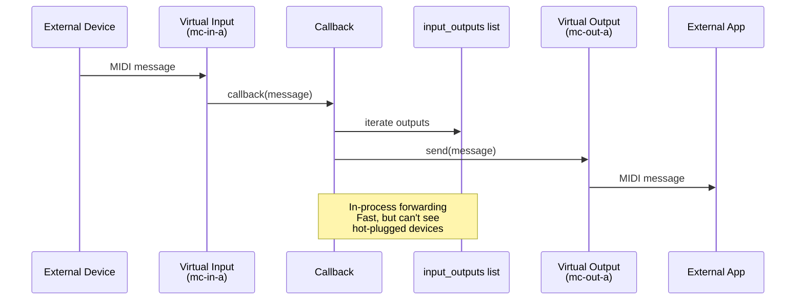
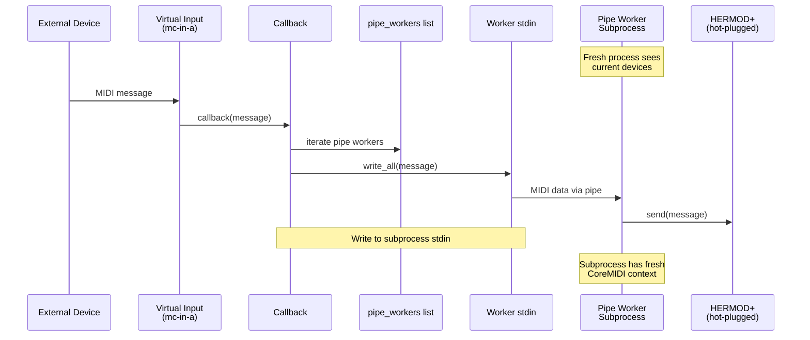

# midi-cable Architecture

## Overview

midi-cable is a Rust TUI application that routes MIDI messages between devices, with special support for hot-plugged devices (devices connected after the application starts).

## The Hot-Plug Problem

CoreMIDI (macOS) and similar MIDI APIs maintain process-level device caches that never refresh. Even creating new `MidiInput`/`MidiOutput` instances in a long-running process won't detect devices plugged in after process startup.

**Solution**: Use subprocess architecture where fresh processes see current device state.

## Architecture Components


## Connection Types

### 1. Virtual Input → Virtual Output (In-Process)

For connections between virtual ports (e.g., mc-in-a → mc-out-a):



**Characteristics**:
- Fast (no IPC overhead)
- In-process broadcast to multiple outputs
- Cannot see hot-plugged devices
- Used for virtual port pairs

### 2. Virtual Input → Hot-Plugged Device (Pipe Worker)

For connections from virtual inputs to hot-plugged hardware (e.g., mc-in-a → HERMOD+):



**Characteristics**:
- Subprocess sees hot-plugged devices
- MIDI data sent via pipe (stdin)
- Worker auto-exits when stdin closes
- Slight IPC overhead
- Used for hot-plug support

### 3. Hardware → Hardware (Regular Worker)

For connections between hardware ports:


**Characteristics**:
- Entire connection runs in subprocess
- Both input and output visible to worker
- Supports hot-plugged devices
- Each connection is isolated process

## Data Structures

### VirtualPorts

```rust
pub struct VirtualPorts {
    // Port pair A
    _input_connection_a: MidiInputConnection<()>,
    _output_connection_a: Arc<Mutex<MidiOutputConnection>>,
    input_outputs_a: Arc<Mutex<Vec<Arc<Mutex<MidiOutputConnection>>>>>,
    pipe_workers_a: Arc<Mutex<Vec<Arc<Mutex<ChildStdin>>>>>,

    // Port pair B (same structure)
    // ...
}
```

- `input_outputs_*`: In-process connections (virtual outputs, fast)
- `pipe_workers_*`: Pipe worker stdin handles (hot-plug devices)

### MidiManager

```rust
pub struct MidiManager {
    pub virtual_ports: Option<VirtualPorts>,
    forwarders: HashMap<Connection, ForwarderHandle>,           // Regular workers
    virtual_input_outputs: HashMap<Connection, Arc<...>>,       // Virtual input connections
    event_tx: Sender<AppEvent>,
    monitoring_active: Arc<AtomicBool>,
}
```

## Message Flow Examples

### Example 1: External Device → mc-in-a → mc-out-b → Application


This works because mc-out-b is a virtual output, handled in-process.

### Example 2: External Device → mc-in-a → HERMOD+ (hot-plugged)


This requires a pipe worker because:
1. HERMOD+ was plugged in after main process started
2. Main process can't see it (stale CoreMIDI cache)
3. Pipe worker subprocess has fresh CoreMIDI context
4. Pipe worker can enumerate and connect to HERMOD+

### Example 3: Hardware → HERMOD+ (hot-plugged)


Regular worker subprocess has fresh CoreMIDI context and can see both input and output.

## Process Lifecycle

### Pipe Worker


### Regular Worker


## Key Design Decisions

### Why Subprocess Architecture?

**Problem**: CoreMIDI process-level caching prevents detection of hot-plugged devices.

**Solutions Considered**:
1. ❌ Poll for device changes in main process → doesn't work, cache never refreshes
2. ❌ Use CoreMIDI notifications → notifications fire but enumeration still returns stale list
3. ✅ Subprocess enumeration → fresh process sees current state

**Trade-offs**:
- ✅ Reliable hot-plug detection
- ✅ Each subprocess is isolated
- ⚠️ Slight performance overhead (process spawning, IPC)
- ⚠️ More complex architecture

### Why Two Worker Types?

**Pipe Workers** (for virtual input connections):
- Virtual inputs use callbacks (can't run in subprocess)
- Need IPC mechanism → stdin pipe is simplest
- Automatic cleanup when stdin closes

**Regular Workers** (for hardware connections):
- Entire connection runs in subprocess
- No IPC needed
- Simpler architecture for this use case

### Why Virtual Port Pairs?

Two independent pairs (A/B) provide:
- Message isolation (pair A traffic doesn't affect pair B)
- Flexible routing (can create complex MIDI patches)
- Clear separation of concerns

## Startup Sequence


The polling step is critical: it ensures that subprocesses (workers) will see the virtual ports before we try to create connections.

## Hot-Plug Detection


The monitor uses subprocess enumeration because:
1. CoreMIDI notifications fire when devices change
2. But main process enumeration still returns stale list
3. Subprocess sees fresh device state
4. UI updates with current devices

## Connection Cleanup

When a connection is removed:

**Virtual Input Connection**:
1. Remove from `virtual_input_outputs` HashMap
2. Drop the stdin `Arc<Mutex<ChildStdin>>`
3. When all Arc refs dropped, stdin closes
4. Pipe worker reads EOF and exits cleanly

**Regular Connection**:
1. Remove from `forwarders` HashMap
2. Drop the `ForwarderHandle`
3. `ForwarderHandle::drop()` calls `child.kill()`
4. Worker process terminates

## Error Handling

### Worker Spawn Failures
- If pipe worker spawn fails → connection creation fails immediately
- If regular worker spawn fails → connection creation fails immediately
- Error propagated to UI, user sees connection failed

### Runtime Failures
- If pipe worker can't find output → worker exits, stdin EOF detected
- If pipe worker send fails → logged to stderr (redirected to log file)
- If virtual callback send fails → error logged, other outputs still receive message

### Device Removal
- Port monitoring detects device removal (via subprocess enumeration)
- Stale connections cleaned up automatically
- UI shows connections as inactive/removed

## Performance Considerations

### Latency
- **In-process forwarding**: ~0.1ms (direct callback)
- **Pipe worker forwarding**: ~0.5-1ms (IPC overhead)
- **Regular worker forwarding**: ~0.5-1ms (IPC overhead)

Acceptable for most MIDI use cases (humans can't perceive <5ms latency).

### Resource Usage
- Each worker subprocess: ~2-3 MB memory
- Typical usage: 5-10 connections = 10-30 MB total
- CPU: negligible when idle, ~1-2% per active connection

### Scaling
- Tested with 10+ simultaneous connections
- No practical limit (bounded by system resources)
- Each worker is isolated, no cross-talk

## Testing Strategy

### Manual Testing
1. Start app, verify virtual ports created
2. Plug in MIDI device while running
3. Create connection from mc-in-a to hot-plugged device
4. Send MIDI to mc-in-a, verify receipt on hot-plugged device
5. Unplug device, verify connection cleanup

### Debugging
- Worker stderr → `/tmp/mc-worker.log`
- Pipe worker stderr → `/tmp/mc-pipe-worker.log`
- Main process → `/tmp/mc-app.log`
- Check logs for spawn failures, send errors, enumeration issues

## Future Improvements

Potential enhancements:
1. **Connection pooling**: Reuse workers instead of spawning per connection
2. **Bidirectional pipes**: Support virtual output → hot-plug connections
3. **Performance monitoring**: Track latency, dropped messages per connection
4. **Health checks**: Detect and restart crashed workers
5. **Configuration**: Make worker spawn strategy configurable

## Summary

The pipe worker architecture solves the hot-plug problem through subprocess isolation:

- ✅ Virtual inputs work with hot-plugged devices
- ✅ Hardware connections work with hot-plugged devices
- ✅ Clean automatic cleanup
- ✅ Acceptable performance overhead
- ✅ Robust error handling

The key insight: **subprocess enumeration bypasses CoreMIDI process-level caching**, enabling reliable hot-plug support without OS-level workarounds.
